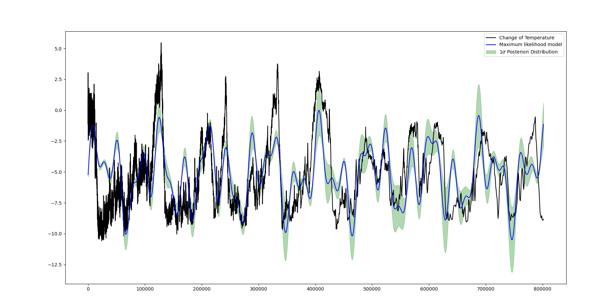
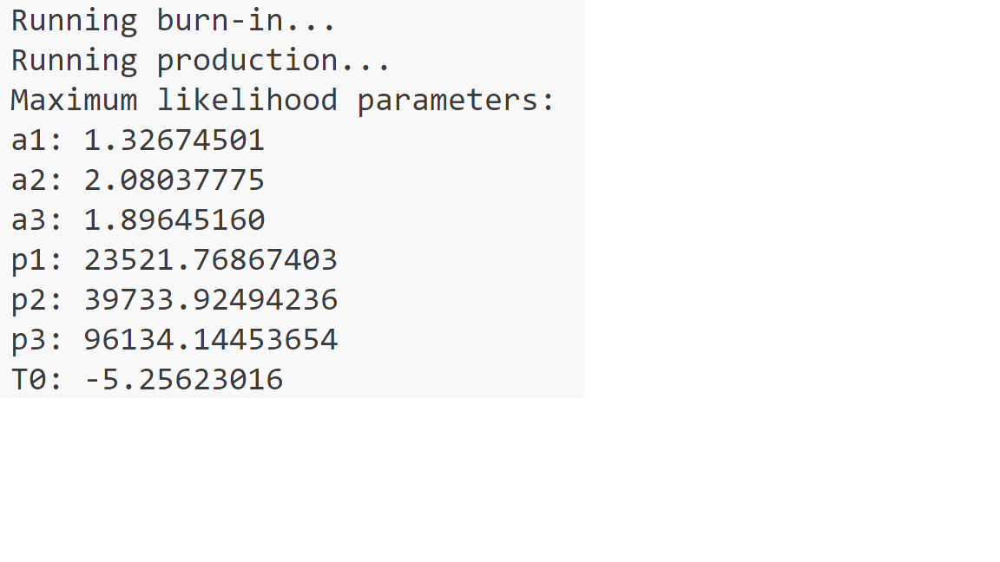

# 贝叶斯分析的小小实战

## 项目内容

我实现了简单的贝叶斯分析，使用了emcee库来实现MCMC方法，从数据文件 data 2.txt 中进行了贝叶斯分析，抽取了参数的后验分布样本，然后通过绘图来展示了模型的不确定性。

## 项目结果
最大似然参数：

**a1:** 1.32674501

**a2:** 2.08037775

**a3:** 1.89645160

**p1:** 23521.76867403

**p2:** 39733.92494236

**p3:** 96134.14453654

**T0:** -5.25623016

## 项目结构

项目包含以下内容：

1. [源码](../py%20document/Bayesian%20Analysis.py)

2. [数据集](../dataset/data%202.txt)

3. **效果图：**

4. **最大似然参数：**

