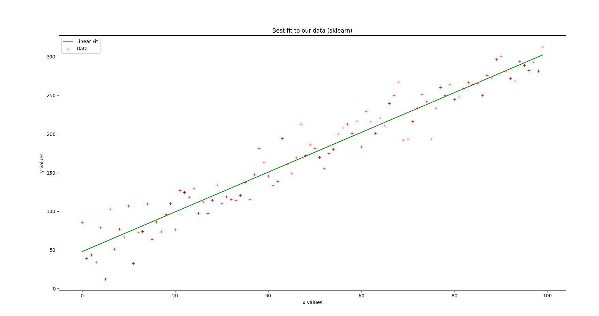
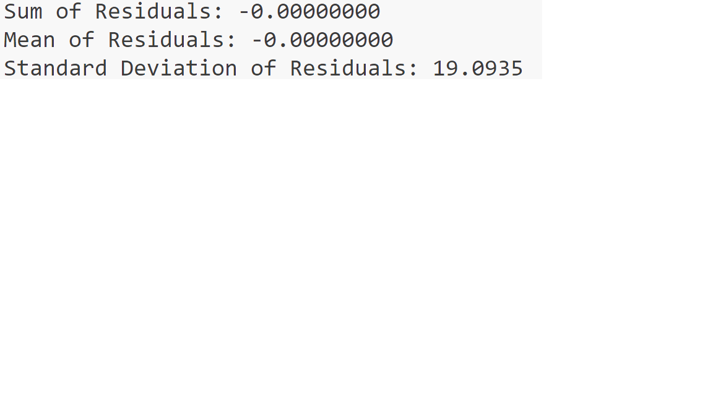

# 线性回归的小小实战

## 项目内容

我使用了python的 scikit-learn内置函数对data 1.txt文本里面数据进行线性拟合,然后计算残差,最后绘制原始数据和拟合曲线。

## 项目结果

根据打印的残差评估结果：

**Sum of Residuals:** -0.00000000 

**Mean of Residuals:** -0.00000000

**Standard Deviation of Residuals:** 19.0935  

这些值表明，在拟合模型时，残差的总和和均值非常接近零。标准差为19.0935表示残差的分布相对分散，这可能说明模型在某些地方拟合得不够好，导致残差的离散程度较大。

## 项目结构

项目包含以下内容：

1. [源码](../py%20document/Linear%20Regression.py)

2. [数据集](../dataset/data%201.txt)

3. **效果图：**

4. **残差图：**

