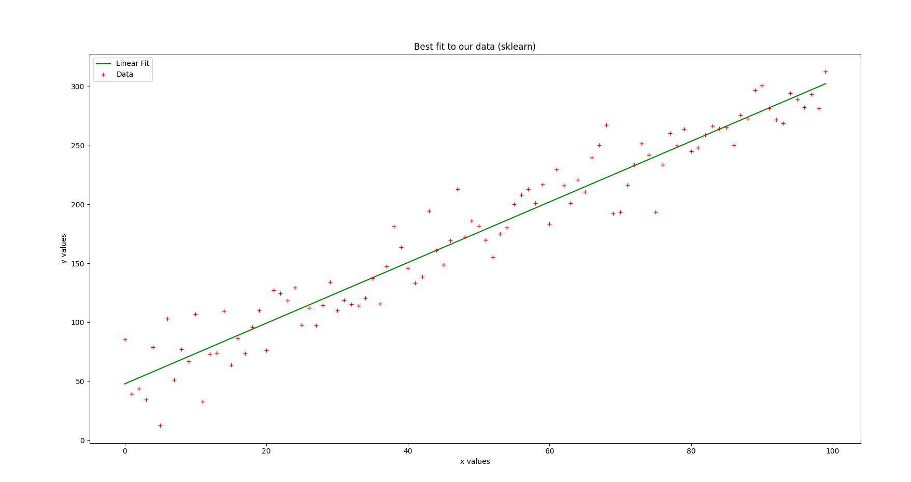
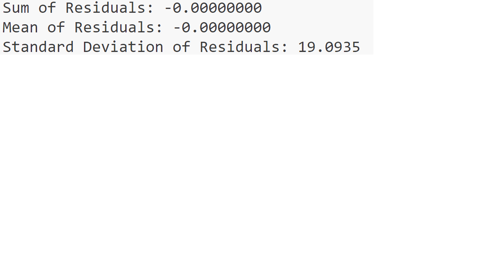

# Linear Regression

## Project Description

I used python's scikit-learn built-in function to linearly fit the data in the data 1.txt text, then calculated the residual, and finally drew the original data and the fitting curve.

## Project Content

Residual Assessment Results：

**Sum of Residuals:** -0.00000000 

**Mean of Residuals:** -0.00000000

**Standard Deviation of Residuals:** 19.0935  

These values show that the sum and mean of residuals are very close to zero when fitting the model. A standard deviation of 19.0935 indicates that the distribution of the residuals is relatively dispersed, which may indicate that the model is not well fitted in some places, resulting in a large degree of dispersion of the residuals.

## Project Structure

The project contains the following：

1. [Sound Code](../Py%20document/Linear%20Regression.py)

2. [Dataset](../Dataset/data%201.txt)

3. **Effect Picture：**

4. **Residual Plot：**

